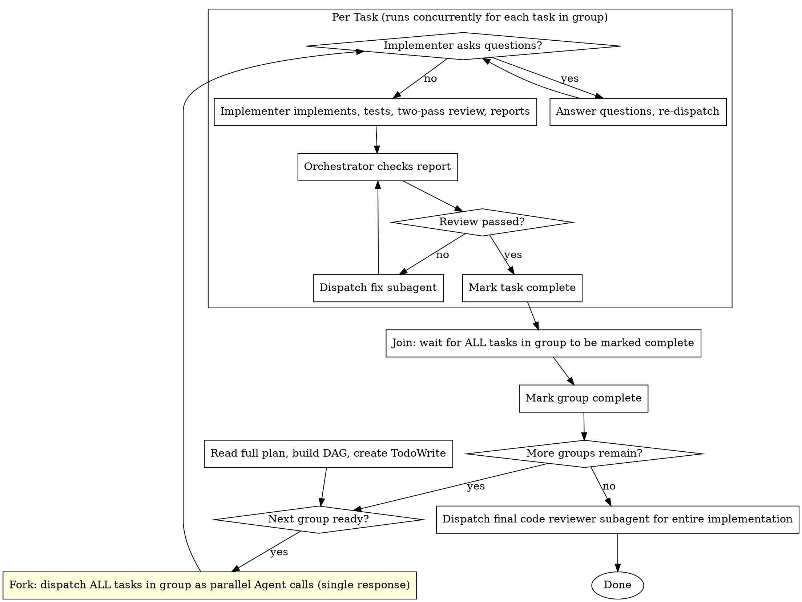

# Subagent-Driven Development

Execute plan by dispatching fresh subagent per task. Each implementer handles implementation, testing, and a structured two-pass review (spec compliance then code quality) before reporting back. Tasks that the plan marks as parallelizable run concurrently.

**Why subagents:** You delegate tasks to specialized agents with isolated context. By precisely crafting their instructions and context, you ensure they stay focused and succeed at their task. They should never inherit your session's context or history — you construct exactly what they need. This also preserves your own context for coordination work.

**Core principle:** Fresh subagent per task, lean context, maximum parallelism

**Continuous execution:** Do not pause to check in with your human partner between tasks or groups. Execute all tasks from the plan without stopping. The only reasons to stop are: BLOCKED status you cannot resolve, ambiguity that genuinely prevents progress, or all tasks complete. "Should I continue?" prompts and progress summaries waste their time — they asked you to execute the plan, so execute it.

## Preflight — before any dispatch

Read the plan file at `docs/plans/<name>.md`. Count the `### Task N:` headers to determine N (the highest task number). Implementers receive the plan path plus their task number — they read their own `### Task N:` section from the plan.

## The Process



For parallel groups, dispatch multiple implementers in the same turn. **Parallel dispatch means multiple `Agent` tool calls in a single response — do not send any response between dispatches.** Each gets the plan path and its task number. All run concurrently. Wait for all to complete before moving to the next group.

## Model Selection

Use the least powerful model that can handle each role to conserve cost and increase speed.

**Mechanical implementation tasks** (isolated functions, clear specs, 1-2 files): use a fast, cheap model. Most implementation tasks are mechanical when the plan is well-specified.

**Integration and judgment tasks** (multi-file coordination, pattern matching, debugging): use a standard model.

**Architecture, design, and review tasks**: use the most capable available model.

**Task complexity signals:**

- Touches 1-2 files with a complete spec → cheap model
- Touches multiple files with integration concerns → standard model
- Requires design judgment or broad codebase understanding → most capable model

## Parallelization

The plan encodes task dependencies via `Parallel with:` and `Depends on:` fields. The orchestrator builds a DAG from these fields and dispatches tasks in groups:

1. **Build the DAG** from the plan's dependency metadata
2. **Validate** that parallel tasks have no file overlaps (sanity check — the plan should already ensure this)
3. **Dispatch parallel groups** — all tasks in a group launch as multiple `Agent` tool calls in a single response (not one response per task)
4. **Wait for all** in the group to complete before starting the next group
5. **Sequential tasks** (with dependencies) run one at a time after their dependencies complete

If a parallel implementer asks questions, answer that implementer while the others continue working.

## Context for Implementers

Each implementer gets the plan path, its task number, and lean context from the orchestrator. The context should contain **only what is NOT in the plan**:

- **Ideafile path** (`docs/ideas/<slug>.md`) — the north star, for the implementer to consult when in doubt about intent or direction. Pass the path, not the contents.
- Inter-task state: what previous tasks produced that this task depends on (e.g., "Task 1 created `AuthService` at `src/auth.ts`")
- Project conventions not captured in the plan (e.g., import style, naming patterns)
- Working directory and branch info
- Workspace policy: implementers must not stage files, commit, merge, or clean up worktrees

Do NOT repeat architecture, file lists, or step details from the plan — the implementer reads the plan directly.

## Handling Implementer Status

Implementer subagents report one of four statuses. Handle each appropriately:

**DONE:** Implementer completed work and passed both review passes. Check the review results in the report — if the orchestrator agrees, mark task complete.

**DONE_WITH_CONCERNS:** The implementer completed the work but flagged doubts. Read the concerns and review results before proceeding. If concerns are about correctness or scope, dispatch a fix subagent. If they're observations (e.g., "this file is getting large"), note them and proceed.

**NEEDS_CONTEXT:** The implementer needs information that wasn't provided. Provide the missing context and re-dispatch.

**BLOCKED:** The implementer cannot complete the task. Assess the blocker:

1. If it's a context problem, provide more context and re-dispatch with the same model
2. If the task requires more reasoning, re-dispatch with a more capable model
3. If the task is too large, break it into smaller pieces
4. If the plan itself is wrong, escalate to the human

**Never** ignore an escalation or force the same model to retry without changes. If the implementer said it's stuck, something needs to change.

## Dispatch

The implementer's static instructions live in the `implementing-tasks` skill. The orchestrator only sends the plan path, task number, and lean context.

**How to dispatch each implementer:**

- Dispatch a general-purpose agent and instruct it to invoke the `implementing-tasks` skill before beginning.

See `./implementer-prompt.md` for the dispatch template and examples.

## Example Workflow

```
You: I'm using Subagent-Driven Development to execute this plan.

[Preflight:
  - Read plan: docs/plans/feature-plan.md (count "### Task N:" headers → N=5)]
[Build DAG from plan metadata:
  Tasks 1,2: parallel (no dependencies, no file overlap)
  Task 3: depends on Tasks 1,2
  Task 4: depends on Task 3
  Task 5: depends on Task 4]
[Create TodoWrite with all tasks]

--- Group 1: Tasks 1 & 2 (parallel) ---

[Dispatch two implementers in same turn:]
  - Task 1: plan=docs/plans/feature-plan.md, task=1 + context: "working dir: /project, do not stage or commit"
  - Task 2: plan=docs/plans/feature-plan.md, task=2 + context: "working dir: /project, do not stage or commit"

Task 1 Implementer: "Before I begin - should the hook be installed at user or system level?"
Task 2 Implementer: [No questions, proceeds]

You (to Task 1): "User level (~/.config/Codeflow/hooks/)"

[Task 2 completes first]
Task 2 Implementer:
  - Status: DONE
  - Implemented verify/repair modes
  - 8/8 tests passing
  - Spec review: ✅ all requirements met, nothing extra
  - Code quality review: ✅ clean, well-tested

[Mark Task 2 complete]

[Task 1 completes]
Task 1 Implementer:
  - Status: DONE_WITH_CONCERNS
  - Implemented install-hook command
  - 5/5 tests passing
  - Spec review: ✅ all requirements met
  - Code quality review: ⚠️ found magic string for path, extracted constant
  - Concern: "install path hardcoded — should it be configurable?"

[Concern is an observation, review passed — mark Task 1 complete]

--- Group 2: Task 3 (sequential, depends on 1,2) ---

[Dispatch implementer with plan=docs/plans/feature-plan.md, task=3 + context:
  "Task 1 created install-hook at src/hooks/install.ts.
   Task 2 created verify/repair at src/hooks/recovery.ts.
   Do not stage or commit; the FSM handles final staging and commit after acceptance."]

Task 3 Implementer:
  - Status: DONE
  - Updated README, plugin.json, marketplace.json
  - Spec review: ✅
  - Code quality review: ✅

[Mark Task 3 complete]

... Tasks 4, 5 ...

[After all tasks]
[Dispatch final code review for entire implementation — specialized agent if available, else general agent + reviewing-code skill]
Final reviewer: All requirements met, ready for FSM acceptance

Done!
```

## Advantages

**vs. Manual execution:**

- Subagents follow TDD naturally
- Fresh context per task (no confusion)
- Parallel tasks run concurrently (DAG-based scheduling)
- Subagent can ask questions (before AND during work)

**Efficiency gains:**

- Lean context — orchestrator provides only what's not in the plan
- Inline reviews — no separate reviewer subagent dispatches (saves 2 round-trips per task)
- Parallelization — independent tasks run concurrently
- Questions surfaced before work begins (not after)

**Quality gates:**

- Two-pass inline review: spec compliance first, then code quality
- Implementer fixes issues during review before reporting back
- Orchestrator verifies review results in the report
- Final code reviewer checks entire implementation holistically

## Red Flags

**Never:**

- Start implementation on main/master branch without explicit user consent
- Dispatch parallel tasks one at a time in separate responses — parallel means multiple `Agent` tool calls in a **single** response
- Dispatch parallel tasks that have file overlaps (validate the DAG)
- Repeat context already in the plan (architecture, file lists, steps)
- Skip scene-setting context (implementer needs to understand where task fits)
- Ignore subagent questions (answer before letting them proceed)
- Accept a report where the implementer's review flagged issues but didn't fix them
- Move to next group while any task in the current group has open issues

**If subagent asks questions:**

- Answer clearly and completely
- Provide additional context if needed
- Don't rush them into implementation

**If implementer's review found issues it couldn't fix:**

- Dispatch fix subagent with specific instructions from the review
- Don't try to fix manually (context pollution)

**If subagent fails task:**

- Dispatch fix subagent with specific instructions
- Don't try to fix manually (context pollution)

**Workspace discipline:**

- Implementers must not stage files or commit.
- Implementers must not merge branches, remove worktrees, prune worktrees, or perform cleanup.
- The FSM owns acceptance, final staging, committing, and any worktree handoff.

## Integration

**Required workflow skills:**

- **using-git-worktrees** - Optional: Use only when the user explicitly requests a worktree
- **writing-plans** - Creates the plan file (`docs/plans/<name>.md`) that this skill executes.

**Subagents should use:**

- **test-driven-development** - Subagents follow TDD for each task
